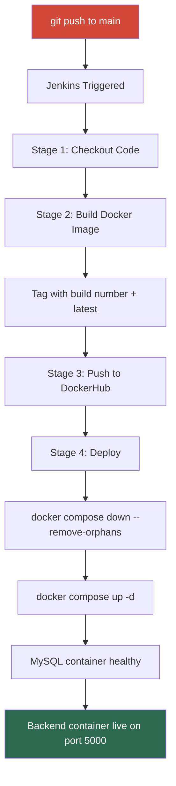

# 📝 Noted — Dockerized Notes & Journal App


> A full-stack **Notes & Journal** web application built with Node.js, Express, and MySQL — fully Dockerized and automatically built, pushed to DockerHub, and deployed via a **Jenkins CI/CD pipeline** on every commit.

---

## 📋 Table of Contents

- [Overview](#-overview)
- [Architecture](#-architecture)
- [Pipeline Flow](#-pipeline-flow)
- [Tech Stack](#️-tech-stack)
- [Project Structure](#-project-structure)
- [Running Locally](#️-running-locally)
- [CI/CD Pipeline Setup](#-cicd-pipeline-setup)
- [API Reference](#-api-reference)
- [Docker Details](#-docker-details)
- [Environment Variables](#-environment-variables)
- [What I Learned](#-what-i-learned)
- [Author](#-author)

---

## 🌟 Overview

This project demonstrates a real-world DevOps workflow using Jenkins, Docker, and Docker Compose. A push to the `main` branch automatically:

1. **Checks out** the latest code from GitHub
2. **Builds** a Docker image from the Node.js backend
3. **Pushes** the image to Docker Hub with a build-number tag and a `latest` tag
4. **Deploys** the full stack (backend + MySQL) via Docker Compose with secrets injected from Jenkins credentials

No manual steps after setup. Just `git push`.

---

## 🏗️ Architecture

```
┌──────────────────────────────────────────────────────────────┐
│                      Developer Machine                       │
│                      git push origin main                    │
└─────────────────────────┬────────────────────────────────────┘
                          │ triggers
                          ▼
┌──────────────────────────────────────────────────────────────┐
│                     Jenkins Pipeline                         │
│                                                              │
│  ┌──────────────┐  ┌──────────────┐   ┌────────────────────┐ │
│  │   Checkout   │─▶│ Build Image  │─▶│   Push to Hub      │ │
│  │   from Git   │  │ (Dockerfile) │   │  :build_num+latest │ │
│  └──────────────┘  └──────────────┘   └────────────────────┘ │
│                                              │               │
│                                              ▼               │
│                                    ┌────────────────────┐    │
│                                    │  Deploy via        │    │
│                                    │  docker compose    │    │
│                                    └────────────────────┘    │
└──────────────────────────────────────────────────────────────┘
          │                                     │
          ▼                                     ▼
┌──────────────────┐                 ┌─────────────────────────┐
│    Docker Hub    │                 │     Docker Host         │
│  nev007/notes-   │                 │  ┌───────────────────┐  │
│  backend:latest  │                 │  │  notes-backend    │  │
│  nev007/notes-   │                 │  │  port 5000        │  │
│  backend:<build> │                 │  ├───────────────────┤  │
└──────────────────┘                 │  │  notes-mysql      │  │
                                     │  │  (internal only)  │  │
                                     │  └───────────────────┘  │
                                     └─────────────────────────┘
```

---

## 🔄 Pipeline Flow



---

## 🛠️ Tech Stack

| Layer | Technology | Purpose |
|---|---|---|
| Backend | Node.js 18, Express 4 | REST API + static file serving |
| Database | MySQL 8 | Persistent notes storage |
| Frontend | Vanilla HTML/CSS/JS | Single-page app served by Express |
| Containerization | Docker, Docker Compose V2 | Multi-container orchestration |
| CI/CD | Jenkins Declarative Pipeline | Automated build, push, deploy |
| Image Registry | Docker Hub | Public container image hosting |

---

## 📁 Project Structure

```
dockerized-noted-app/
├── app/
│   └── backend/
│       ├── src/
│       │   ├── config/
│       │   │   └── db.js                 # MySQL connection pool + DB/table init
│       │   ├── controllers/
│       │   │   └── notes.controller.js   # CRUD logic for notes
│       │   ├── routes/
│       │   │   └── notes.routes.js       # Express route definitions
│       │   ├── public/
│       │   │   └── index.html            # Frontend SPA (served statically)
│       │   └── server.js                 # Express app + boot sequence
│       ├── Dockerfile                    # Production image (node:18-alpine)
│       ├── .dockerignore
│       └── package.json
├── docker-compose.yml                    # MySQL + backend service definitions
├── Jenkinsfile                           # 4-stage CI/CD pipeline
├── .env.example                          # Environment variable reference
└── .gitignore
```

---

## 🖥️ Running Locally

### Prerequisites

- [Docker](https://docs.docker.com/get-docker/) installed
- [Docker Compose V2](https://docs.docker.com/compose/install/) installed (`docker compose version`)

### Steps

**1. Clone the repository**

```bash
git clone https://github.com/Nev-007/dockerized-noted-app.git
cd dockerized-noted-app
```

**2. Set up your environment file**

```bash
cp .env.example .env
```

Edit `.env` and set your passwords:

```env
MYSQL_ROOT_PASSWORD=your_strong_password
DB_PASSWORD=your_strong_password
DB_NAME=notesdb
```

> ⚠️ `MYSQL_ROOT_PASSWORD` and `DB_PASSWORD` **must be the same value** — the backend connects to MySQL as the root user using `DB_PASSWORD`.

**3. Build and start**

```bash
docker compose up -d --build
```

**4. Open the app**

Visit **http://localhost:5000**

**5. Stop the app**

```bash
docker compose down
```

---

## 🔁 CI/CD Pipeline Setup

### Prerequisites on the Jenkins Agent

- Docker and Docker Compose V2 installed
- Jenkins user added to the `docker` group:

```bash
sudo usermod -aG docker jenkins
sudo systemctl restart jenkins

# Verify
sudo -u jenkins docker ps
```

### Required Jenkins Credentials

Go to **Manage Jenkins → Credentials → Global → Add Credentials** and create these exactly:

| Credential ID | Kind | Value |
|---|---|---|
| `dockerhub-creds` | Username with password | Your Docker Hub username + access token |
| `mysql-root-password` | Secret text | A strong MySQL root password |
| `db-password` | Secret text | The **same value** as `mysql-root-password` |

> ⚠️ The credential **IDs must match exactly** — even a single character difference will cause the pipeline to fail.

### Creating the Pipeline Job

1. Open Jenkins → **New Item**
2. Name it `noted-app-pipeline` → select **Pipeline** → **OK**
3. Under **Pipeline**, set **Definition** to `Pipeline script from SCM`
4. **SCM** → `Git`
5. **Repository URL** → `https://github.com/Nev-007/dockerized-noted-app.git`
6. **Branch** → `*/main`
7. **Script Path** → `Jenkinsfile`
8. **Save** → **Build Now**

### Pipeline Stages

```
✅ Checkout Code       — clones from GitHub main branch
✅ Build Backend Image — docker build tagged with build number + latest
✅ Push Image          — pushes both tags to DockerHub, then docker logout
✅ Deploy              — docker compose down + up with secrets from Jenkins
```

---

## 🌐 API Reference

Base URL: `http://localhost:5000/api`

| Method | Endpoint | Description |
|---|---|---|
| `GET` | `/health` | Health check — returns server uptime |
| `GET` | `/notes` | Get all notes (supports `?tag=`, `?search=`, `?pinned=`) |
| `GET` | `/notes/:id` | Get a single note by ID |
| `POST` | `/notes` | Create a new note |
| `PUT` | `/notes/:id` | Update an existing note |
| `DELETE` | `/notes/:id` | Delete a note |
| `PATCH` | `/notes/:id/pin` | Toggle pin status on a note |

### Example — Create a Note

```bash
curl -X POST http://localhost:5000/api/notes \
  -H "Content-Type: application/json" \
  -d '{"title": "My First Note", "content": "Hello, Noted!", "tag": "personal"}'
```

```json
{
  "success": true,
  "data": {
    "id": 1,
    "title": "My First Note",
    "content": "Hello, Noted!",
    "tag": "personal",
    "pinned": 0,
    "created_at": "2025-03-18T10:00:00.000Z",
    "updated_at": "2025-03-18T10:00:00.000Z"
  }
}
```

---

## 🐳 Docker Details

The backend image uses `node:18-alpine` for a minimal footprint. `devDependencies` (like `nodemon`) are excluded at build time using `--omit=dev`.

The MySQL container has a built-in healthcheck — the backend only starts **after** MySQL is confirmed healthy, preventing race-condition connection failures:

```yaml
healthcheck:
  test: ["CMD", "mysqladmin", "ping", "-h", "localhost", "-uroot", "-p${MYSQL_ROOT_PASSWORD}"]
  interval: 10s
  timeout: 5s
  retries: 5
```

Each Jenkins build pushes two Docker Hub tags:
- `nev007/notes-backend:<build_number>` — immutable, traceable per build
- `nev007/notes-backend:latest` — always points to the most recent build

---

## 🔐 Environment Variables

| Variable | Default | Description |
|---|---|---|
| `MYSQL_ROOT_PASSWORD` | — | Root password for MySQL (required) |
| `DB_PASSWORD` | — | Password the backend uses to connect — must match above |
| `DB_NAME` | `notesdb` | MySQL database name |
| `PORT` | `5000` | Port the Express server listens on |
| `CORS_ORIGIN` | `*` | Allowed CORS origin |
| `FRONTEND_PATH` | `./public` | Path to static frontend files inside the container |

Copy `.env.example` to `.env` and fill in your values. **Never commit `.env` to version control.**

---

## 📖 What I Learned

- **Declarative Jenkins pipelines** — structuring multi-stage pipelines, proper environment variable scoping, and `withCredentials` for secure secret injection
- **Docker layer caching** — ordering `COPY package*.json` before `COPY . .` so dependencies are only reinstalled when `package.json` actually changes
- **Docker Compose healthchecks** — using `condition: service_healthy` on `depends_on` to eliminate backend startup race conditions against MySQL
- **Secrets management** — storing all credentials in the Jenkins credential store and injecting them at runtime, never hardcoded in code or committed in `.env`
- **Image tagging strategy** — dual-tagging with a build number (traceability) and `latest` (convenience) on every pipeline run
- **CI/CD debugging** — diagnosing credential ID mismatches, Docker socket permissions for the Jenkins user, and `docker compose` V1 vs V2 command differences

---

> Built with ❤️ by [Nev](https://github.com/Nev-007)
